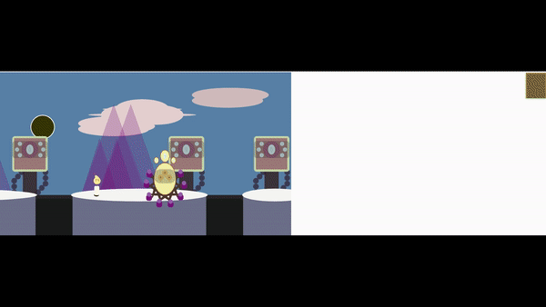

# Willo

### Stack/Technologies used:-

**HTML**

**JavaScript**

**p5**

  

NOTE:- This is a very early build of my Willo project as I attempt to reclaim my finialised version (backing up is so very important and is a lesson I have indeed learned the hard way!)

"Willo" is my final project submission for my Introduction to Programming I module, as part of my BSc Computer Science degree.

Willo is a 1-level (WIP) side-scroller that was an introduction to programming, but students were allowed boundless levels of creativity and freedom with the concept and implementation, within a 1-level format.

Alas a lot is still missing in this build version but its better to showcase the direction the game was heading and its still somewhat playable! - sound effects, ambiance, main music, various added animations/ mechanics, death mechanics, a final boss and the end screen have unfortunetly not been developed in this build version - I will update as soon as I am able to retrieve the files.

All assets were created by me in p5.js.

Help Willo recover his sense of self and safeguard his 'spark' in strange wilds.

Thank you for visiting!

 

## Getting Started

These instructions will get you a copy of the project up and running on your local machine for development and testing purposes. See deployment for notes on how to deploy the project on a live system.

### Installing

A step by step series of examples that tell you how to get a development env running
 
 
**1 - Under the repository name, right-hand side, click the 'Code' button.**
 

**2 - In the following pop-up box, depending on personal prefrences, there are a number of methods for you to get up and running - whether that be from downloading the zip itself, or using https / github CLI.**
 

#### Demo

